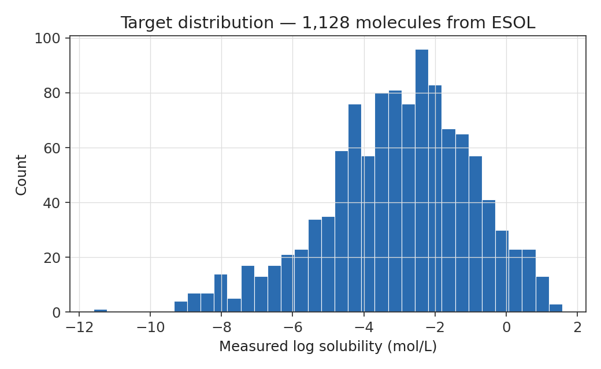
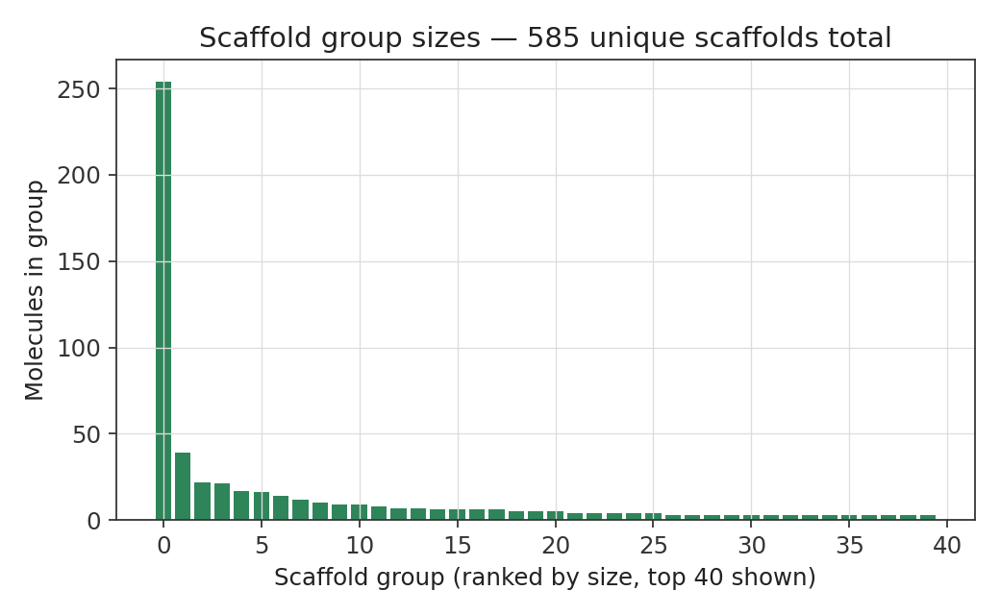
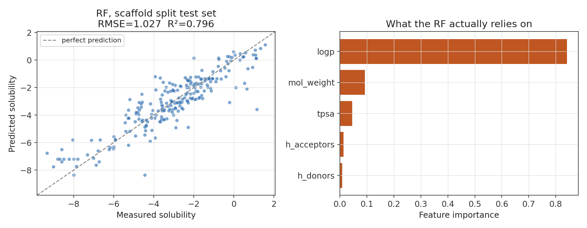
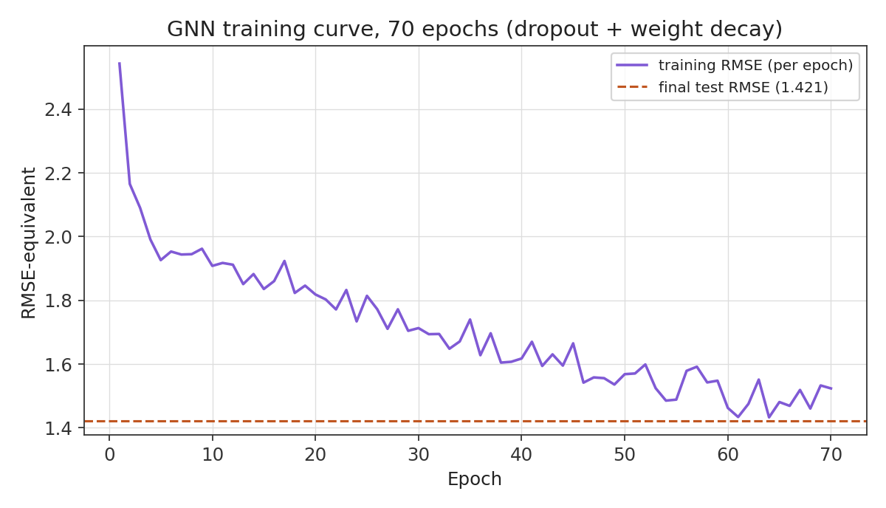
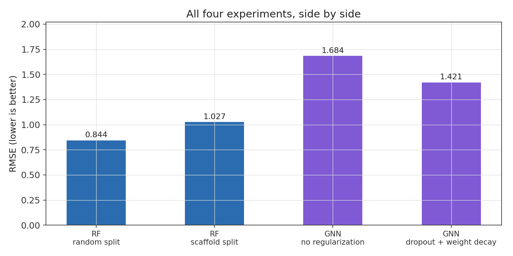

# Molecular Property Prediction: QSAR vs. GNN

A side project I've been chipping away at to bridge my computer engineering
background into cheminformatics and medical AI, ahead of starting a
bioinformatics master's. The question I wanted to actually answer for
myself, rather than take on faith from a paper: does a graph neural network,
learning its own representation straight from molecular structure, actually
beat a classical QSAR baseline built from hand-picked descriptors — or is
that only true once you have a lot more data than a small benchmark set
gives you?

Everything here — the scaffold split, the SMILES-to-graph conversion, the
GNN itself — is built from scratch rather than imported from a
higher-level helper library. Slower to get working, but the point was to
actually understand each piece rather than just get a number out.

## The dataset

[ESOL / Delaney](https://pubs.acs.org/doi/10.1021/ci034243x) — 1,128 small
molecules with measured aqueous solubility. Small enough to iterate on
quickly, real enough to hit real problems along the way.

| | |
|---|---|
| Molecules | 1,128 |
| Target | Measured log solubility (mol/L) |
| Target mean / std | -3.05 / 2.10 |
| Target range | -11.6 to 1.58 |
| Unique Murcko scaffolds | 585 |
| Largest single scaffold group | 254 molecules |



## How the split was built

Instead of a plain random train/test split, I implemented a
[Bemis-Murcko scaffold split](https://en.wikipedia.org/wiki/Scaffold_hopping)
by hand — group molecules by their core ring structure, then split by
group rather than by row, so no structural family leaks between train and
test. It's the standard rigorous approach in cheminformatics for exactly
this reason: a random split lets near-identical molecules land on both
sides, which quietly makes the task easier than it should be. Below is
the actual distribution of group sizes in this dataset — a handful of
common scaffolds (benzene rings, mostly) dominate, with a long tail of
one-off structures.



## Baseline: Random Forest on RDKit descriptors

Five descriptors (molecular weight, LogP, TPSA, H-bond donors/acceptors)
into a Random Forest. Nothing fancy, and that's sort of the point — it's
the thing any fancier model needs to actually beat before it's earned its
complexity.



LogP dominates the feature importances, which lines up with real
chemistry rather than being an artifact — LogP measures how much a
molecule prefers a non-aqueous environment, so it's almost the same
underlying property as aqueous solubility viewed from the other side.

## The graph neural network

SMILES converted into a proper molecular graph (atoms as nodes, bonds as
edges, both directions stored per bond), fed through two `GCNConv` layers
with global mean pooling into a single regression output. Trained with
dropout and weight decay after an earlier unregularized run showed
textbook overfitting — training loss noticeably better than test loss.



Worth noting: training RMSE stays a bit *above* the final test RMSE for
most of the run here. That's expected with dropout in play — during
training the network is working with a randomly-damaged version of itself
every forward pass, so training loss is measuring something artificially
harder than what the fully-intact network achieves at evaluation time.

## Results, all four experiments together



| Model | Split | RMSE | R² |
|---|---|---|---|
| Random Forest | Random | 0.844 | 0.849 |
| Random Forest | Scaffold | 1.027 | 0.796 |
| GNN, no regularization | Scaffold | 1.684 | — |
| GNN, dropout + weight decay | Scaffold | 1.421 | — |

So: the Random Forest wins here, even after the GNN got real regularization
and closed a lot of the gap. This isn't a disappointing result so much as
an expected one for the data regime — GNNs tend to need considerably more
than ~900 training molecules before their "learn the representation from
scratch" advantage actually pays off over hand-crafted descriptors. Small
molecular datasets are pretty consistently where classical QSAR still
holds its ground.

## Bugs worth remembering

A few of these cost real debugging time, and all of them were the kind
that don't crash — they just quietly give you a wrong number that looks
plausible:

- Trained a model against `ESOL predicted log solubility` (a value copied
  from the original paper's own model) instead of `measured log
  solubility` (the real experimental value) for a while — inflated every
  metric until it got traced back through several layers of seemingly
  unrelated symptoms.
- `df["col"][row] = value` silently fails to write anything back into a
  DataFrame under Copy-on-Write semantics — no error, just an empty frame.
  `.loc[row, col] = value` is the fix.
- Reshaping a flattened `(N, 2)` edge-index tensor into `(2, N)` instead of
  transposing it scrambles which atoms are actually connected to which —
  produces a structurally valid graph that's chemically wrong, silently.
- `MSELoss` on mismatched shapes (`[batch, 1]` vs. `[batch]`) broadcasts
  into a full pairwise comparison instead of erroring, computing a real
  but meaningless number.

## Stack

```
rdkit
pandas
scikit-learn
torch
torch-geometric
matplotlib
```

## Running it

```bash
pip install rdkit pandas scikit-learn matplotlib
pip install torch
pip install torch_geometric

jupyter notebook data_rdkit_basics.ipynb
```

The dataset is pulled directly from the
[DeepChem GitHub repo](https://github.com/deepchem/deepchem) inside the
notebook, so there's no manual download or credentialing step.

## What I'd try next

- Swap `GCNConv` for `GraphSAGE` or `GAT` and see if the architecture
  itself matters at this data size
- Run the same comparison on a bigger dataset (Tox21) to see if the GNN's
  disadvantage actually shrinks with more data, as the theory predicts
- Try fine-tuning a pretrained molecular model (ChemBERTa, MolFormer)
  instead of training a GNN from nothing
- Track a real per-epoch test/validation curve during training, not just
  a single number at the end — would make the overfitting story here a
  lot more precise

---

Built by Artem, as part of a self-directed bioinformatics and medical AI
learning track ahead of grad school.
